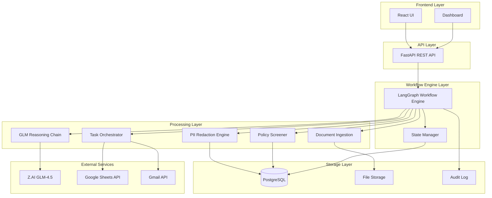
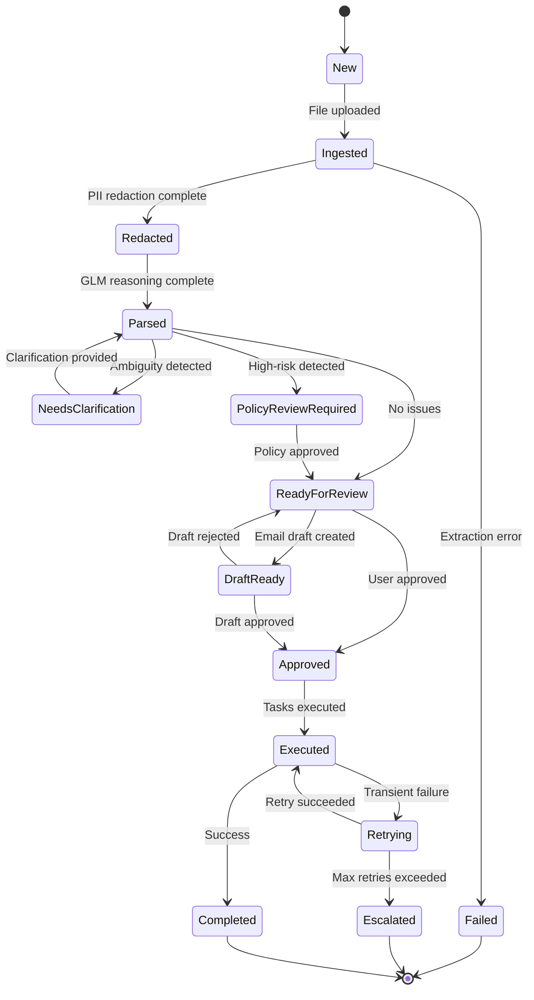

# Design Document: StitchFlow V2

## Overview

StitchFlow V2 is an AI-powered human-in-the-loop (HITL) decision-support engine built on a stateful workflow architecture. The system uses Z.AI GLM-4.5 as its central reasoning engine, orchestrated through LangGraph for managing complex, multi-step workflows with human approval points.

### Core Design Principles

1. **Stateful Workflow Management**: LangGraph manages explicit workflow states and transitions, enabling resumable workflows and clear audit trails
2. **Multi-Step Reasoning**: GLM-4.5 performs chained reasoning operations (classification → extraction → analysis → recommendation)
3. **Privacy-First Processing**: PII redaction occurs before any AI processing to ensure compliance
4. **Human-in-the-Loop**: Critical decision points require explicit human approval before proceeding
5. **Graceful Degradation**: Retry logic with exponential backoff and escalation for persistent failures
6. **Real-World Constraint Handling**: Explicit handling of ambiguity, missing data, conflicts, and partial failures

### Technology Stack

- **Backend**: FastAPI (REST API), LangChain (LLM orchestration), LangGraph (workflow engine), Z.AI GLM-4.5 (reasoning), Pydantic (validation)
- **Frontend**: React + TypeScript + Tailwind CSS + shadcn/ui
- **Database**: PostgreSQL (or SQLite for MVP)
- **Vector Store**: Optional Chroma for RAG (can start with keyword-based policy matching)
- **External APIs**: Google Sheets API, Gmail API

## Architecture

### High-Level Architecture




### Workflow State Machine




### Component Architecture

The system is organized into distinct layers:

1. **Frontend Layer**: React-based UI for workflow management, document upload, review interfaces, and T&C comparison
2. **API Layer**: FastAPI REST endpoints for workflow operations, file uploads, and state queries
3. **Workflow Engine Layer**: LangGraph-based stateful workflow orchestration with state persistence
4. **Processing Layer**: Specialized components for document processing, reasoning, policy screening, and task execution
5. **Storage Layer**: PostgreSQL for structured data, file storage for documents, immutable audit logs
6. **External Services**: Z.AI GLM-4.5 for reasoning, Google APIs for Sheets and Gmail integration

## Components and Interfaces

### 1. Document Ingestion Component

**Responsibilities**:
- Accept file uploads (PDF, DOCX, TXT, email formats)
- Extract text content from various file formats
- Store original files and extracted text
- Trigger workflow state transition to "Ingested"

**Key Functions**:

```python
def ingest_document(workflow_id: str, file: UploadFile) -> IngestionResult:
    """
    Ingest a document and extract text content.
    
    Args:
        workflow_id: Unique workflow identifier
        file: Uploaded file object
        
    Returns:
        IngestionResult with extracted text and metadata
        
    Raises:
        UnsupportedFormatError: If file format is not supported
        ExtractionError: If text extraction fails
    """
    pass

def extract_text(file_path: str, file_type: str) -> str:
    """Extract text from file based on type."""
    pass
```

**Dependencies**: File storage system, text extraction libraries (PyPDF2, python-docx, email parser)

### 2. PII Redaction Engine

**Responsibilities**:
- Identify PII patterns in text (names, emails, phones, addresses, SSNs)
- Replace PII with masked tokens ([NAME], [EMAIL], [PHONE], etc.)
- Maintain bidirectional mapping between masked tokens and original values
- Store both original and redacted versions

**Key Functions**:
```python
def redact_pii(text: str) -> RedactionResult:
    """
    Redact PII from text and create token mapping.
    
    Args:
        text: Original text content
        
    Returns:
        RedactionResult with redacted text and token mapping
    """
    pass

def restore_pii(redacted_text: str, token_map: Dict[str, str]) -> str:
    """Restore original PII from redacted text using token mapping."""
    pass

def identify_pii_patterns(text: str) -> List[PIIMatch]:
    """Identify all PII patterns in text."""
    pass
```

**PII Patterns**:
- Names: Capitalized word sequences, common name patterns
- Emails: RFC 5322 email regex
- Phones: Various phone number formats (US, international)
- Addresses: Street address patterns
- SSNs: XXX-XX-XXXX format

**Dependencies**: Regex patterns, NER models (optional), spaCy (optional)

### 3. GLM Reasoning Chain

**Responsibilities**:
- Perform multi-step reasoning on redacted text
- Classify document type and intent
- Extract structured entities and key information
- Detect ambiguities, missing data, and conflicts
- Generate action recommendations with confidence scores

**Key Functions**:

```python
def run_reasoning_chain(redacted_text: str, context: Dict) -> ReasoningResult:
    """
    Execute multi-step GLM reasoning chain.
    
    Args:
        redacted_text: PII-redacted text content
        context: Additional context (clarifications, previous decisions)
        
    Returns:
        ReasoningResult with classification, entities, ambiguities, recommendations
    """
    pass

def classify_document(text: str) -> Classification:
    """Classify document type and intent using GLM."""
    pass

def extract_entities(text: str, doc_type: str) -> List[Entity]:
    """Extract structured entities based on document type."""
    pass

def detect_ambiguities(text: str, entities: List[Entity]) -> List[Ambiguity]:
    """Identify ambiguous or unclear content."""
    pass

def detect_conflicts(entities: List[Entity]) -> List[Conflict]:
    """Identify conflicting data points."""
    pass

def generate_recommendations(
    classification: Classification,
    entities: List[Entity],
    ambiguities: List[Ambiguity],
    conflicts: List[Conflict]
) -> List[Recommendation]:
    """Generate action recommendations with confidence scores."""
    pass
```

**Reasoning Chain Steps**:
1. **Classification**: Determine document type (event request, T&C, inquiry, etc.) and intent
2. **Entity Extraction**: Extract structured data (dates, names, amounts, requirements)
3. **Ambiguity Detection**: Identify unclear or missing information
4. **Conflict Detection**: Find contradictory data points
5. **Recommendation Generation**: Suggest actions with confidence scores (0-1)

**LangChain Integration**:
- Use LangChain's `LLMChain` for individual reasoning steps
- Chain multiple prompts for sequential reasoning
- Use structured output parsing with Pydantic models

**Dependencies**: LangChain, Z.AI GLM-4.5 API client, Pydantic models

### 4. Policy Screener

**Responsibilities**:
- Evaluate recommendations against compliance rules
- Flag policy violations with evidence
- Assign confidence scores to recommendations
- Determine if human review is required

**Key Functions**:

```python
def screen_policies(recommendations: List[Recommendation]) -> PolicyScreeningResult:
    """
    Screen recommendations against policy rules.
    
    Args:
        recommendations: List of AI-generated recommendations
        
    Returns:
        PolicyScreeningResult with violations, confidence scores, review flags
    """
    pass

def evaluate_rule(recommendation: Recommendation, rule: PolicyRule) -> RuleEvaluation:
    """Evaluate a single recommendation against a policy rule."""
    pass

def calculate_risk_score(violations: List[Violation]) -> float:
    """Calculate overall risk score from violations."""
    pass
```

**Policy Matching Approaches**:

**MVP Approach (Keyword-Based)**:
- Define policy rules as keyword patterns and conditions
- Match recommendations against rule patterns
- Simple, fast, no vector store required

**Future Enhancement (RAG-Based)**:
- Store policy documents in vector store (Chroma)
- Perform semantic search for relevant policies
- Use GLM to evaluate policy compliance

**Policy Rule Structure**:
```python
class PolicyRule:
    rule_id: str
    category: str  # "financial", "legal", "operational"
    keywords: List[str]
    conditions: Dict[str, Any]
    severity: str  # "low", "medium", "high", "critical"
    requires_review: bool
```

**Dependencies**: Policy rule database, optional vector store (Chroma)

### 5. Task Orchestrator

**Responsibilities**:
- Determine which tools/APIs to invoke based on recommendations
- Execute tasks in correct sequence
- Handle API failures with retry logic
- Sync data with Google Sheets
- Create Gmail drafts

**Key Functions**:

```python
def orchestrate_tasks(recommendations: List[Recommendation]) -> OrchestrationResult:
    """
    Execute tasks based on recommendations.
    
    Args:
        recommendations: Approved recommendations to execute
        
    Returns:
        OrchestrationResult with task execution results
    """
    pass

def sync_to_sheets(data: Dict, sheet_id: str) -> SyncResult:
    """Sync extracted data to Google Sheets."""
    pass

def create_gmail_draft(recipient: str, subject: str, body: str) -> DraftResult:
    """Create Gmail draft for review."""
    pass

def execute_with_retry(task: Task, max_retries: int = 3) -> TaskResult:
    """Execute task with exponential backoff retry logic."""
    pass
```

**Task Types**:
- `SYNC_SHEETS`: Update Google Sheets with extracted data
- `CREATE_DRAFT`: Generate Gmail draft
- `UPDATE_DASHBOARD`: Refresh dashboard state
- `NOTIFY_USER`: Send notification

**Retry Logic**:
- Initial retry delay: 1 second
- Exponential backoff: delay *= 2
- Max retries: 3
- After max retries: transition to "Escalated" state

**Dependencies**: Google Sheets API client, Gmail API client, retry library (tenacity)

### 6. LangGraph Workflow Engine

**Responsibilities**:
- Manage workflow state transitions
- Persist workflow state to database
- Validate state transitions
- Handle human-in-the-loop approval points
- Coordinate component execution

**Key Functions**:
```python
def create_workflow(initial_data: Dict) -> Workflow:
    """Create new workflow instance."""
    pass

def transition_state(workflow_id: str, new_state: WorkflowState, reason: str) -> None:
    """Transition workflow to new state with validation."""
    pass

def get_workflow_state(workflow_id: str) -> WorkflowState:
    """Retrieve current workflow state."""
    pass

def wait_for_human_approval(workflow_id: str) -> ApprovalResult:
    """Pause workflow and wait for human decision."""
    pass
```

**LangGraph State Graph**:

```python
from langgraph.graph import StateGraph, END

# Define workflow state
class WorkflowState(TypedDict):
    workflow_id: str
    current_state: str
    document_text: str
    redacted_text: str
    token_map: Dict[str, str]
    reasoning_result: Optional[ReasoningResult]
    policy_result: Optional[PolicyScreeningResult]
    clarifications: List[Dict]
    recommendations: List[Recommendation]
    human_decisions: List[Decision]
    error: Optional[str]

# Build state graph
workflow = StateGraph(WorkflowState)

# Add nodes (processing steps)
workflow.add_node("ingest", ingest_node)
workflow.add_node("redact", redact_node)
workflow.add_node("reason", reason_node)
workflow.add_node("screen_policy", policy_node)
workflow.add_node("wait_clarification", clarification_node)
workflow.add_node("wait_approval", approval_node)
workflow.add_node("execute_tasks", orchestration_node)

# Add edges (transitions)
workflow.add_edge("ingest", "redact")
workflow.add_edge("redact", "reason")
workflow.add_conditional_edges(
    "reason",
    route_after_reasoning,
    {
        "needs_clarification": "wait_clarification",
        "continue": "screen_policy"
    }
)
workflow.add_conditional_edges(
    "screen_policy",
    route_after_policy,
    {
        "high_risk": "wait_approval",
        "low_risk": "execute_tasks"
    }
)
workflow.add_edge("wait_clarification", "reason")
workflow.add_edge("wait_approval", "execute_tasks")
workflow.add_edge("execute_tasks", END)

# Set entry point
workflow.set_entry_point("ingest")
```

**Human-in-the-Loop Integration**:
- LangGraph supports interrupting execution at specific nodes
- Use `interrupt_before=["wait_approval"]` to pause for human input
- Resume execution after human provides decision

**Dependencies**: LangGraph, LangChain, PostgreSQL for state persistence

### 7. Audit Logger

**Responsibilities**:
- Record all workflow actions with timestamps
- Log GLM inputs, outputs, and confidence scores
- Record human decisions and reasoning
- Store policy screening results
- Maintain immutable audit trail

**Key Functions**:

```python
def log_action(
    workflow_id: str,
    action_type: str,
    actor: str,
    details: Dict,
    timestamp: datetime
) -> None:
    """Log workflow action to immutable audit trail."""
    pass

def log_glm_decision(
    workflow_id: str,
    input_text: str,
    output: Dict,
    confidence: float,
    timestamp: datetime
) -> None:
    """Log GLM reasoning decision."""
    pass

def log_human_decision(
    workflow_id: str,
    user_id: str,
    decision: str,
    reasoning: str,
    timestamp: datetime
) -> None:
    """Log human approval or rejection."""
    pass

def get_audit_trail(workflow_id: str) -> List[AuditEntry]:
    """Retrieve complete audit trail for workflow."""
    pass
```

**Audit Entry Structure**:
- Workflow ID
- Timestamp (UTC)
- Action type (state_transition, glm_decision, human_decision, policy_check, task_execution)
- Actor (system, user_id, glm)
- Details (JSON blob with action-specific data)
- Hash (for tamper detection)

**Dependencies**: PostgreSQL with append-only audit table

## Data Models

### Core Entities

```python
from pydantic import BaseModel, Field
from typing import List, Dict, Optional, Literal
from datetime import datetime
from enum import Enum

class WorkflowState(str, Enum):
    NEW = "New"
    INGESTED = "Ingested"
    REDACTED = "Redacted"
    PARSED = "Parsed"
    NEEDS_CLARIFICATION = "NeedsClarification"
    POLICY_REVIEW_REQUIRED = "PolicyReviewRequired"
    READY_FOR_REVIEW = "ReadyForReview"
    DRAFT_READY = "DraftReady"
    APPROVED = "Approved"
    EXECUTED = "Executed"
    RETRYING = "Retrying"
    FAILED = "Failed"
    ESCALATED = "Escalated"
    COMPLETED = "Completed"

class Workflow(BaseModel):
    workflow_id: str
    state: WorkflowState
    created_at: datetime
    updated_at: datetime
    created_by: str
    document_path: Optional[str]
    document_text: Optional[str]
    redacted_text: Optional[str]
    token_map: Dict[str, str] = {}
    metadata: Dict = {}

class IngestionResult(BaseModel):
    workflow_id: str
    extracted_text: str
    file_type: str
    file_size: int
    extraction_time: float
    success: bool
    error: Optional[str]

class PIIMatch(BaseModel):
    pii_type: Literal["name", "email", "phone", "address", "ssn"]
    original_value: str
    masked_token: str
    start_pos: int
    end_pos: int

class RedactionResult(BaseModel):
    workflow_id: str
    original_text: str
    redacted_text: str
    token_map: Dict[str, str]
    pii_matches: List[PIIMatch]
    redaction_time: float

class Classification(BaseModel):
    document_type: str  # "event_request", "terms_conditions", "inquiry", etc.
    intent: str
    confidence: float = Field(ge=0.0, le=1.0)
    reasoning: str

class Entity(BaseModel):
    entity_type: str  # "date", "person", "amount", "requirement", etc.
    value: str
    confidence: float = Field(ge=0.0, le=1.0)
    source_text: str
    metadata: Dict = {}

class Ambiguity(BaseModel):
    ambiguity_type: str  # "missing_data", "unclear_reference", "multiple_interpretations"
    description: str
    affected_entities: List[str]
    clarification_question: str
    possible_interpretations: List[str] = []

class Conflict(BaseModel):
    conflict_type: str  # "contradictory_dates", "inconsistent_amounts", etc.
    description: str
    conflicting_entities: List[Entity]
    evidence: List[str]

class Recommendation(BaseModel):
    recommendation_id: str
    action_type: str  # "sync_sheets", "create_draft", "notify_user", etc.
    description: str
    confidence: float = Field(ge=0.0, le=1.0)
    parameters: Dict
    reasoning: str
    dependencies: List[str] = []

class ReasoningResult(BaseModel):
    workflow_id: str
    classification: Classification
    entities: List[Entity]
    ambiguities: List[Ambiguity]
    conflicts: List[Conflict]
    recommendations: List[Recommendation]
    reasoning_time: float

class PolicyRule(BaseModel):
    rule_id: str
    category: str
    name: str
    description: str
    keywords: List[str]
    conditions: Dict
    severity: Literal["low", "medium", "high", "critical"]
    requires_review: bool

class Violation(BaseModel):
    rule_id: str
    rule_name: str
    severity: str
    description: str
    evidence: List[str]
    affected_recommendations: List[str]

class PolicyScreeningResult(BaseModel):
    workflow_id: str
    violations: List[Violation]
    risk_score: float = Field(ge=0.0, le=1.0)
    requires_human_review: bool
    screening_time: float

class Decision(BaseModel):
    decision_id: str
    workflow_id: str
    decision_type: str  # "approval", "rejection", "clarification", "modification"
    user_id: str
    timestamp: datetime
    reasoning: Optional[str]
    modifications: Dict = {}

class TaskResult(BaseModel):
    task_id: str
    task_type: str
    success: bool
    result_data: Dict
    error: Optional[str]
    execution_time: float
    retry_count: int = 0

class OrchestrationResult(BaseModel):
    workflow_id: str
    task_results: List[TaskResult]
    overall_success: bool
    failed_tasks: List[str] = []

class AuditEntry(BaseModel):
    entry_id: str
    workflow_id: str
    timestamp: datetime
    action_type: str
    actor: str
    details: Dict
    hash: str
```

### Database Schema

**Workflows Table**:

```sql
CREATE TABLE workflows (
    workflow_id VARCHAR(36) PRIMARY KEY,
    state VARCHAR(50) NOT NULL,
    created_at TIMESTAMP NOT NULL,
    updated_at TIMESTAMP NOT NULL,
    created_by VARCHAR(255) NOT NULL,
    document_path TEXT,
    document_text TEXT,
    redacted_text TEXT,
    token_map JSONB,
    metadata JSONB
);

CREATE INDEX idx_workflows_state ON workflows(state);
CREATE INDEX idx_workflows_created_at ON workflows(created_at);
CREATE INDEX idx_workflows_created_by ON workflows(created_by);
```

**Reasoning Results Table**:
```sql
CREATE TABLE reasoning_results (
    result_id VARCHAR(36) PRIMARY KEY,
    workflow_id VARCHAR(36) REFERENCES workflows(workflow_id),
    classification JSONB NOT NULL,
    entities JSONB NOT NULL,
    ambiguities JSONB NOT NULL,
    conflicts JSONB NOT NULL,
    recommendations JSONB NOT NULL,
    reasoning_time FLOAT,
    created_at TIMESTAMP NOT NULL
);

CREATE INDEX idx_reasoning_workflow ON reasoning_results(workflow_id);
```

**Policy Screening Results Table**:
```sql
CREATE TABLE policy_screening_results (
    result_id VARCHAR(36) PRIMARY KEY,
    workflow_id VARCHAR(36) REFERENCES workflows(workflow_id),
    violations JSONB NOT NULL,
    risk_score FLOAT NOT NULL,
    requires_human_review BOOLEAN NOT NULL,
    screening_time FLOAT,
    created_at TIMESTAMP NOT NULL
);

CREATE INDEX idx_policy_workflow ON policy_screening_results(workflow_id);
```

**Decisions Table**:
```sql
CREATE TABLE decisions (
    decision_id VARCHAR(36) PRIMARY KEY,
    workflow_id VARCHAR(36) REFERENCES workflows(workflow_id),
    decision_type VARCHAR(50) NOT NULL,
    user_id VARCHAR(255) NOT NULL,
    timestamp TIMESTAMP NOT NULL,
    reasoning TEXT,
    modifications JSONB
);

CREATE INDEX idx_decisions_workflow ON decisions(workflow_id);
CREATE INDEX idx_decisions_user ON decisions(user_id);
```

**Audit Log Table**:
```sql
CREATE TABLE audit_log (
    entry_id VARCHAR(36) PRIMARY KEY,
    workflow_id VARCHAR(36) REFERENCES workflows(workflow_id),
    timestamp TIMESTAMP NOT NULL,
    action_type VARCHAR(100) NOT NULL,
    actor VARCHAR(255) NOT NULL,
    details JSONB NOT NULL,
    hash VARCHAR(64) NOT NULL
);

CREATE INDEX idx_audit_workflow ON audit_log(workflow_id);
CREATE INDEX idx_audit_timestamp ON audit_log(timestamp);
```

**Policy Rules Table**:
```sql
CREATE TABLE policy_rules (
    rule_id VARCHAR(36) PRIMARY KEY,
    category VARCHAR(100) NOT NULL,
    name VARCHAR(255) NOT NULL,
    description TEXT,
    keywords JSONB NOT NULL,
    conditions JSONB NOT NULL,
    severity VARCHAR(20) NOT NULL,
    requires_review BOOLEAN NOT NULL,
    created_at TIMESTAMP NOT NULL,
    updated_at TIMESTAMP NOT NULL
);

CREATE INDEX idx_policy_category ON policy_rules(category);
CREATE INDEX idx_policy_severity ON policy_rules(severity);
```

## API Specifications

### REST API Endpoints

**Workflow Management**:

```
POST /api/v1/workflows
Create new workflow

Request Body:
{
  "created_by": "user@example.com",
  "metadata": {}
}

Response: 201 Created
{
  "workflow_id": "uuid",
  "state": "New",
  "created_at": "2024-01-01T00:00:00Z"
}
```

```
POST /api/v1/workflows/{workflow_id}/upload
Upload document to workflow

Request: multipart/form-data with file

Response: 200 OK
{
  "workflow_id": "uuid",
  "state": "Ingested",
  "extraction_result": {
    "extracted_text": "...",
    "file_type": "pdf",
    "success": true
  }
}
```

```
GET /api/v1/workflows/{workflow_id}
Get workflow details

Response: 200 OK
{
  "workflow_id": "uuid",
  "state": "ReadyForReview",
  "created_at": "2024-01-01T00:00:00Z",
  "updated_at": "2024-01-01T00:05:00Z",
  "reasoning_result": {...},
  "policy_result": {...}
}
```

```
GET /api/v1/workflows
List workflows with filtering

Query Parameters:
- state: Filter by workflow state
- created_by: Filter by creator
- limit: Page size (default 20)
- offset: Page offset

Response: 200 OK
{
  "workflows": [...],
  "total": 100,
  "limit": 20,
  "offset": 0
}
```

**Human Decisions**:

```
POST /api/v1/workflows/{workflow_id}/clarify
Provide clarification for ambiguities

Request Body:
{
  "user_id": "user@example.com",
  "clarifications": [
    {
      "ambiguity_id": "uuid",
      "resolution": "Clarified value"
    }
  ]
}

Response: 200 OK
{
  "workflow_id": "uuid",
  "state": "Parsed",
  "message": "Clarifications recorded, re-running reasoning"
}
```

```
POST /api/v1/workflows/{workflow_id}/approve
Approve workflow recommendations

Request Body:
{
  "user_id": "user@example.com",
  "decision_type": "approval",
  "reasoning": "Looks good",
  "modifications": {}
}

Response: 200 OK
{
  "workflow_id": "uuid",
  "state": "Approved",
  "message": "Workflow approved, executing tasks"
}
```

```
POST /api/v1/workflows/{workflow_id}/reject
Reject workflow recommendations

Request Body:
{
  "user_id": "user@example.com",
  "decision_type": "rejection",
  "reasoning": "Needs revision"
}

Response: 200 OK
{
  "workflow_id": "uuid",
  "state": "ReadyForReview",
  "message": "Workflow rejected"
}
```

**Audit and Monitoring**:

```
GET /api/v1/workflows/{workflow_id}/audit
Get audit trail for workflow

Response: 200 OK
{
  "workflow_id": "uuid",
  "audit_entries": [
    {
      "timestamp": "2024-01-01T00:00:00Z",
      "action_type": "state_transition",
      "actor": "system",
      "details": {...}
    }
  ]
}
```

```
GET /api/v1/dashboard/stats
Get dashboard statistics

Response: 200 OK
{
  "total_workflows": 150,
  "by_state": {
    "New": 5,
    "ReadyForReview": 12,
    "Completed": 100
  },
  "requiring_attention": 12
}
```

### WebSocket API (Optional for Real-Time Updates)

```
WS /api/v1/workflows/{workflow_id}/stream
Stream workflow state changes

Messages:
{
  "event": "state_change",
  "workflow_id": "uuid",
  "old_state": "Parsed",
  "new_state": "ReadyForReview",
  "timestamp": "2024-01-01T00:00:00Z"
}
```


## Correctness Properties

A property is a characteristic or behavior that should hold true across all valid executions of a system—essentially, a formal statement about what the system should do. Properties serve as the bridge between human-readable specifications and machine-verifiable correctness guarantees.

### Property 1: File Upload and Extraction

*For any* supported file type (PDF, DOCX, TXT, email) with valid content, uploading the file should result in successful text extraction and transition to "Ingested" state.

**Validates: Requirements 1.1, 1.2, 1.3**

### Property 2: Extraction Failure Handling

*For any* corrupted or invalid file, attempting extraction should result in transition to "Failed" state with an error logged in the audit trail.

**Validates: Requirements 1.4**

### Property 3: PII Detection

*For any* text containing PII patterns (names, emails, phones, addresses, SSNs), the Redaction Engine should identify all PII instances.

**Validates: Requirements 2.1**

### Property 4: PII Redaction Round-Trip

*For any* text with PII, redacting the text and then restoring it using the token mapping should produce the original text.

**Validates: Requirements 2.2, 2.3, 2.5**

### Property 5: State Machine Transition Validation

*For any* workflow state and attempted transition, the Workflow Engine should only allow valid transitions according to the state machine definition and reject invalid transitions.

**Validates: Requirements 9.2**

### Property 6: Terminal State Immutability

*For any* workflow in a terminal state (Completed, Failed, Escalated), attempting any state transition should be rejected.

**Validates: Requirements 9.3**

### Property 7: State Persistence

*For any* workflow with state changes, simulating a system restart and retrieving the workflow should return the same state as before the restart.

**Validates: Requirements 9.5**

### Property 8: Comprehensive Audit Logging

*For any* workflow action (state transition, GLM decision, human decision, policy screening, task execution), an audit entry should be created with timestamp, actor, and action details.

**Validates: Requirements 9.4, 12.1, 12.2, 12.3, 12.4**

### Property 9: Audit Log Immutability

*For any* audit log entry, attempting to modify or delete it after creation should fail, ensuring tamper-evident logging.

**Validates: Requirements 12.5**

### Property 10: Confidence Score Assignment

*For any* recommendation generated by the Reasoning Chain or Policy Screener, the recommendation should include a confidence score between 0.0 and 1.0.

**Validates: Requirements 3.6, 5.3**

### Property 11: Ambiguity Detection Triggers Clarification

*For any* document where the Reasoning Chain detects ambiguities, the workflow should transition to "Needs Clarification" state and present specific clarification questions.

**Validates: Requirements 4.1, 4.2**

### Property 12: Clarification Re-triggers Reasoning

*For any* workflow in "Needs Clarification" state, providing clarification should store the information and re-run the Reasoning Chain with the updated context.

**Validates: Requirements 4.3, 4.4**

### Property 13: Policy Violation Detection

*For any* recommendation that violates a defined policy rule, the Policy Screener should flag the specific violation with evidence and rule reference.

**Validates: Requirements 5.2**

### Property 14: High-Risk Policy Review

*For any* policy screening result with high-severity violations, the workflow should transition to "Policy Review Required" state.

**Validates: Requirements 5.4**

### Property 15: Google Sheets Sync Round-Trip

*For any* structured data extracted from a document, syncing to Google Sheets and then reading back should preserve all data fields and confidence scores.

**Validates: Requirements 6.1, 6.2, 6.5**

### Property 16: Bidirectional Sheets Sync

*For any* data synced to Google Sheets, manual edits in the sheet should be detected and reflected in the internal workflow state.

**Validates: Requirements 6.3**

### Property 17: Exponential Backoff Retry

*For any* failed operation (Sheets sync, Gmail API call), the system should retry with exponentially increasing delays (1s, 2s, 4s) up to the maximum retry count.

**Validates: Requirements 6.4, 10.2**

### Property 18: Retry Limit Escalation

*For any* operation that fails more than 3 times, the workflow should transition to "Escalated" state and notify administrators.

**Validates: Requirements 10.3, 10.4**

### Property 19: Gmail Draft Creation

*For any* recommendation that includes email communication, the Task Orchestrator should create a Gmail draft and transition the workflow to "Draft Ready" state.

**Validates: Requirements 7.1, 7.2**

### Property 20: Draft Approval Workflow

*For any* workflow in "Draft Ready" state, user approval should send the email, while rejection should transition back to "Ready for Review" state.

**Validates: Requirements 7.4, 7.5**

### Property 21: T&C Clause Extraction

*For any* T&C document uploaded, the system should parse and segment it into individual clauses.

**Validates: Requirements 8.1**

### Property 22: Clause Comparison

*For any* two T&C documents with overlapping clauses, the comparison should identify similarities and differences between corresponding clauses.

**Validates: Requirements 8.2**

### Property 23: Conflict Detection

*For any* document with contradictory data points (e.g., conflicting dates or amounts), the Reasoning Chain should identify the specific conflicts and transition to "Needs Clarification" state.

**Validates: Requirements 11.1, 11.3**

### Property 24: Conflict Resolution Recording

*For any* conflict resolved by a user, the system should record both the resolution and the user's reasoning.

**Validates: Requirements 11.4**

### Property 25: Schema Validation

*For any* structured output generated by the Reasoning Chain, the output should be validated against the defined Pydantic schema before proceeding.

**Validates: Requirements 14.1**

### Property 26: Validation Failure Handling

*For any* output that fails schema validation, the workflow should transition to "Failed" state with specific validation errors logged.

**Validates: Requirements 14.2**

### Property 27: Repeated Validation Failure Escalation

*For any* workflow where schema validation fails more than 3 times, the workflow should transition to "Escalated" state.

**Validates: Requirements 14.5**

### Property 28: Task Orchestration Sequence

*For any* set of recommendations with dependencies, the Task Orchestrator should execute tasks in dependency order (prerequisites before dependents).

**Validates: Requirements 15.2**

### Property 29: Task Execution Completion

*For any* set of tasks where all execute successfully, the workflow should transition to "Executed" state.

**Validates: Requirements 15.4**

### Property 30: Dashboard Workflow Display

*For any* workflow in the system, it should appear in the dashboard grouped by its current state.

**Validates: Requirements 13.1, 13.2**

### Property 31: Dashboard Attention Highlighting

*For any* workflow in states requiring human attention (Needs Clarification, Policy Review Required, Ready for Review, Draft Ready), the dashboard should highlight it.

**Validates: Requirements 13.3**

## Error Handling

### Error Categories

1. **Transient Errors**: Network failures, API rate limits, temporary service unavailability
   - **Strategy**: Retry with exponential backoff (max 3 attempts)
   - **States**: Retrying → Executed (success) or Escalated (failure)

2. **Validation Errors**: Schema validation failures, invalid data formats
   - **Strategy**: Log specific errors, transition to Failed state
   - **Recovery**: Manual intervention or workflow restart with corrected data

3. **Business Logic Errors**: Policy violations, ambiguous data, conflicts
   - **Strategy**: Transition to appropriate review state (Policy Review Required, Needs Clarification)
   - **Recovery**: Human decision required

4. **System Errors**: Database failures, file system errors, critical bugs
   - **Strategy**: Log error, transition to Failed state, alert administrators
   - **Recovery**: System-level intervention required

### Error Response Patterns

```python
class ErrorHandler:
    def handle_error(self, error: Exception, context: Dict) -> ErrorResponse:
        """Route errors to appropriate handlers based on type."""
        if isinstance(error, TransientError):
            return self.handle_transient(error, context)
        elif isinstance(error, ValidationError):
            return self.handle_validation(error, context)
        elif isinstance(error, BusinessLogicError):
            return self.handle_business_logic(error, context)
        else:
            return self.handle_system_error(error, context)
    
    def handle_transient(self, error: TransientError, context: Dict) -> ErrorResponse:
        """Retry with exponential backoff."""
        retry_count = context.get("retry_count", 0)
        if retry_count < 3:
            delay = 2 ** retry_count  # 1s, 2s, 4s
            return ErrorResponse(
                action="retry",
                delay=delay,
                new_state="Retrying"
            )
        else:
            return ErrorResponse(
                action="escalate",
                new_state="Escalated",
                notify_admins=True
            )
    
    def handle_validation(self, error: ValidationError, context: Dict) -> ErrorResponse:
        """Log validation errors and fail workflow."""
        return ErrorResponse(
            action="fail",
            new_state="Failed",
            error_details=error.errors()
        )
    
    def handle_business_logic(self, error: BusinessLogicError, context: Dict) -> ErrorResponse:
        """Route to appropriate review state."""
        if isinstance(error, AmbiguityError):
            return ErrorResponse(
                action="request_clarification",
                new_state="NeedsClarification",
                questions=error.clarification_questions
            )
        elif isinstance(error, PolicyViolationError):
            return ErrorResponse(
                action="request_review",
                new_state="PolicyReviewRequired",
                violations=error.violations
            )
        else:
            return ErrorResponse(
                action="fail",
                new_state="Failed"
            )
```

### Graceful Degradation

- **GLM API Unavailable**: Queue workflows, retry when service recovers
- **Google Sheets API Unavailable**: Store updates locally, sync when available
- **Gmail API Unavailable**: Store drafts locally, create when available
- **Database Connection Lost**: Use connection pooling with automatic reconnection
- **File Storage Unavailable**: Reject new uploads, allow processing of existing workflows

## Testing Strategy

### Dual Testing Approach

StitchFlow V2 requires both unit tests and property-based tests for comprehensive coverage:

- **Unit Tests**: Verify specific examples, edge cases, error conditions, and integration points
- **Property Tests**: Verify universal properties across all inputs through randomization

### Unit Testing Focus

Unit tests should focus on:
- Specific examples demonstrating correct behavior (e.g., redacting a known email address)
- Integration points between components (e.g., workflow engine calling reasoning chain)
- Edge cases (e.g., empty documents, malformed files, special characters)
- Error conditions (e.g., API failures, validation errors)

Avoid writing too many unit tests for scenarios that property tests can cover through randomization.

### Property-Based Testing

**Framework**: Use `hypothesis` for Python property-based testing

**Configuration**:
- Minimum 100 iterations per property test (due to randomization)
- Each test must reference its design document property
- Tag format: `# Feature: stitchflow-v2, Property {number}: {property_text}`

**Example Property Test**:
```python
from hypothesis import given, strategies as st
import hypothesis

@given(
    text=st.text(min_size=10, max_size=1000),
    pii_email=st.emails()
)
@hypothesis.settings(max_examples=100)
def test_property_4_pii_redaction_round_trip(text, pii_email):
    """
    Feature: stitchflow-v2, Property 4: PII Redaction Round-Trip
    
    For any text with PII, redacting the text and then restoring it 
    using the token mapping should produce the original text.
    """
    # Insert PII into text
    text_with_pii = f"{text} Contact: {pii_email}"
    
    # Redact PII
    redaction_result = redact_pii(text_with_pii)
    
    # Restore PII
    restored_text = restore_pii(
        redaction_result.redacted_text,
        redaction_result.token_map
    )
    
    # Verify round-trip
    assert restored_text == text_with_pii
```

**Test Data Generators**:
- **Workflows**: Generate random workflow states and transitions
- **Documents**: Generate text with varying PII patterns
- **Recommendations**: Generate recommendations with random confidence scores
- **Policy Rules**: Generate rules with various keywords and conditions
- **API Responses**: Generate mock Google Sheets and Gmail API responses

**Property Test Coverage**:
- All 31 correctness properties should have corresponding property tests
- Each property test should run at least 100 iterations
- Tests should use Hypothesis strategies to generate diverse inputs
- Tests should verify the property holds across all generated inputs

### Integration Testing

- **End-to-End Workflow Tests**: Test complete workflows from upload to completion
- **API Integration Tests**: Test Google Sheets and Gmail API interactions with mocks
- **Database Integration Tests**: Test state persistence and audit logging
- **LangGraph Integration Tests**: Test workflow state transitions and human-in-the-loop

### Performance Testing

- **GLM Response Time**: Measure reasoning chain latency
- **Database Query Performance**: Ensure queries complete within acceptable time
- **API Rate Limiting**: Test behavior under Google API rate limits
- **Concurrent Workflows**: Test system behavior with multiple simultaneous workflows

### Security Testing

- **PII Redaction Effectiveness**: Verify no PII leaks to GLM
- **Audit Log Integrity**: Verify logs cannot be tampered with
- **Authentication**: Test API authentication and authorization
- **Input Validation**: Test against injection attacks and malformed inputs

